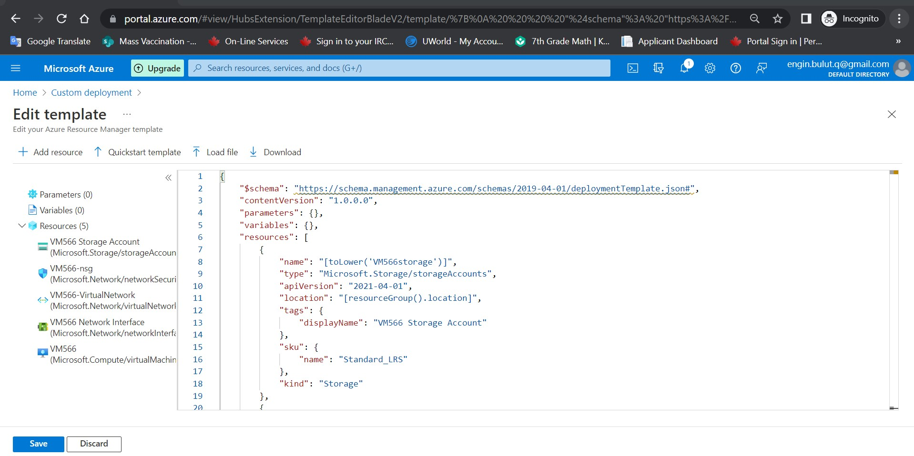
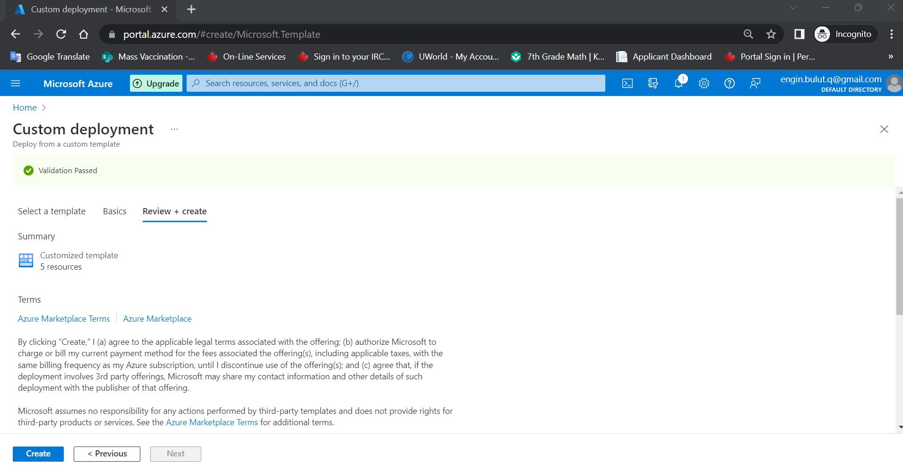
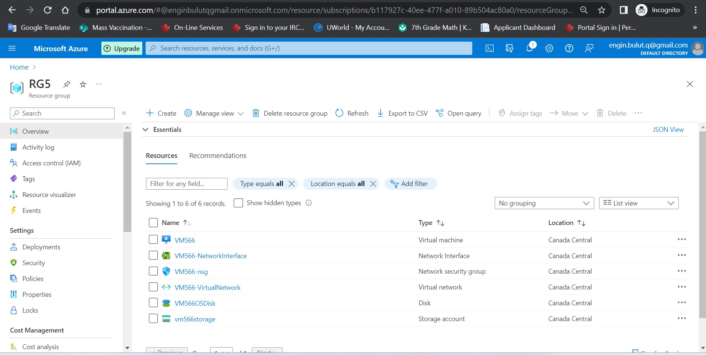

# Create resources with ARM template
Azure portal to create a resource group if doesn't exist. To check your resource group you can go to the Azure portal. 

Create an ARM template file named “storage-account-with-arm-portal” in Visual Studio Code. (make sure you have added all required extensions) Write your code in the ARM template file to create. (codes are provided in JSON format) Deploy your ARM template in the Azure Portal by using previously created resource group. Push your code to your to your GitHub repo.

Resource list:
- VM566
- VM566-NetworkInterface
- VM566-nsg
- VM566-VirtualNetwork
- VM566OSDisk
- vm566storage

Screeshots:

